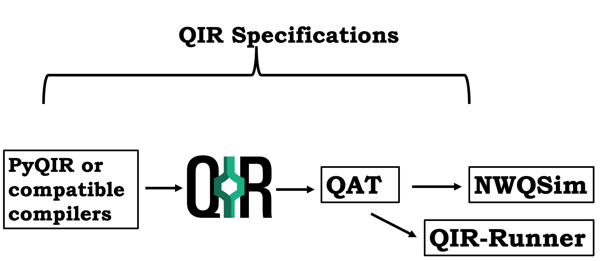

# Overview
The QIR ecosystem comprises multiple projects that collaborate to generate QIR, perform optimizations, lower it to target code, and facilitate simulations.[QIR specifications](qir-book/ecosystem/specs/specs.md) encompass a set of data type, subroutines, and runtime functionalities for acceptable compiled code from the source compiler. A subset of these specifications is used to define a profile for target machine, either quantum devices or simulators. If the source code is developed in a Pythonic framework, then [PyQIR](qir-book/ecosystem/pyqir/pyqir.md) APIs can be used to build the capabilities to lower the source code to QIR. Other development frameworks such as Q# have incorporated the intrinsic functionality to generate QIR. The figure below shows the components of the QIR ecosystem.

To add:
QAT-
QCOR-
QIR Runner-
NWQ-Sim-

