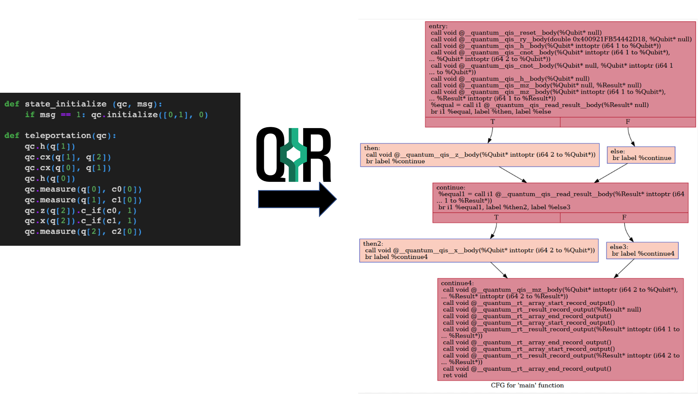

# PyQIR
PyQIR is a set of APIs designed to lower the pythonic source code such as [QuTiP](qir-book/tutorials/qir-emission/qutip/qir-gen.ipynb) and [Qiskit](qir-book/tutorials/qir-emission/qiskit/qir-gen.ipynb) to QIR. It acts as a bridge between the underlying Python quantum libraries of source and QIR. It is not intended to be used for algorithm development, but rather by compiler front-end developers. By leveraging PyQIR, algorithm developers can write quantum programs in their favorite Pythonic quantum development framework, then utilize PyQIR to generate QIR, without having to directly interact with the low-level underlying LLVM implementation.

The current version of PyQIR module has functionalities such as `pyqir.generator`, `pyqir.parser` and `pyqir.evaluator` to lower and assess the Pythonic source code to QIR. With `pyqir.generator.types`, a wide range of [data types](qir-book/ecosystem/specs/data-types.md) and [callables](qir-book/ecosystem/specs/callables.md) can be defined. To combine the benefits of dynamic execution and static compilation, PyQIR is supported by just-in-time (JIT) compilation infrastructure for evaluation and optimization purposes.  Non-Pythonic development frameworks such as Q# implement the generation of QIR into their compiler systems. Please see the [APIs reference](https://www.qir-alliance.org/pyqir/api/index.html) for more details.

You can find examples of [generating](qir-book/tutorials/qir-emission/generation.md) QIR from [Q#](qir-book/tutorials/qir-emission/qsharp/in_jupyter/qsharp-magic.ipynb), [Qiskit](qir-book/tutorials/qir-emission/qiskit/qir-gen.ipynb) and [QuTiP](qir-book/tutorials/qir-emission/qutip/qir-gen.ipynb) in the tutorials section.

As an illustration, the image below shows the control flow graph (CFG) after lowering the quantum teleportation protocol written [Qiskit to QIR](qir-book/tutorials/qir-emission/qiskit/qir-gen.ipynb).

Whether the QIR is generated from PyQIR or a compatible compiler, the code is separated to into classical and quantum blocks. The teleportation protocol, on the left, has an if condition close to the end of its operation. The result from the condition determines the next quantum operation. Due to the quantum device's limitations in handling control flow, the condition is separated from the quantum circuit, shown on the left. By treating classical and quantum code as separate code blocks, the LLVM infrastructure can be leveraged for optimizing the classical code, while the quantum code can be targeted to quantum processors or simulators.
